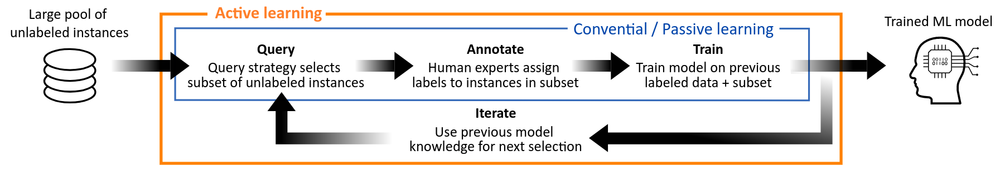
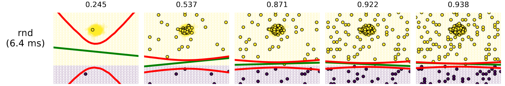
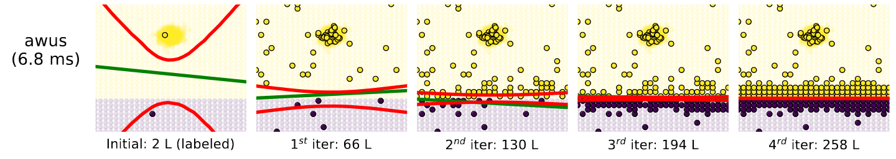

# ALSIM: Active Learning Simulator

**ALSIM** is an active learning strategy simulator. Active learning is a sub-domain
of machine learning focused on the creation of machine learning models using the
lowest amount of annotated data. This is especially interesting for applications
where data acquisition and/or annotation is difficult, expensive and/or time-consuming.
This simulator is able to test newly created active learning strategies and directly
compare them to other algorithms. 





**AWUS** is a novel state-of-the-art active learning query strategy, outperforming
all other strategies currently implemented, at very low computational cost. The journal
paper can be found at [AWUS: Adaptive Weighted Uncertainty Sampling](https://www.sciencedirect.com/science/article/abs/pii/S2214860421005649).

## Main Features / Comments
Major information:

  - Multiple query strategies available out-of-the-box
  - All Scikit-Learn machine learning models supported
  - Fast custom ML models which are optimized for Active Learning available.
  - Visualization build in. 

## How to get it

Git has to be installed to clone: 
```sh
sudo apt install git
```
Clone the repository to current working directory
```sh
git clone https://github.com/gijsvanhoutum/alsim.git
```
We advise to install a new python virtual environment first with:
```sh
python3 -m venv venv
```
Activate environment
```sh
source venv/bin/activate
```
Install all necessary Python packages with:
```sh
pip install -r /alsim/requirements.txt
```
## How to run it

To run execute the following from the current working directory:
```sh
python3 run_simulations.py
```

## TODO

- Expand capabilities which is supported by the ALSIM AWUS paper version.